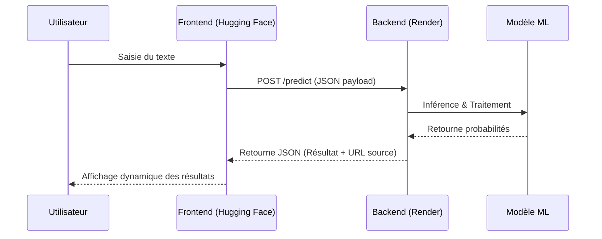

## Architecture du projet

graph TD
    Data[Données Brutes/Txt] -->|Extract| Airflow[Airflow Orchestration]
    Airflow -->|Transform| Clean[Données Nettoyées]
    Clean -->|Train| Model[Entraînement & Tests]
    Model -->|Log| MLflow[MLflow Registry]
    MLflow -->|Deploy| Render[API FastAPI / Render]
    Render -->|Monitor| Evidently[Evidently AI Monitoring]
    Evidently -->|Feedback| Data

## Flux d'inférence (templExtract
