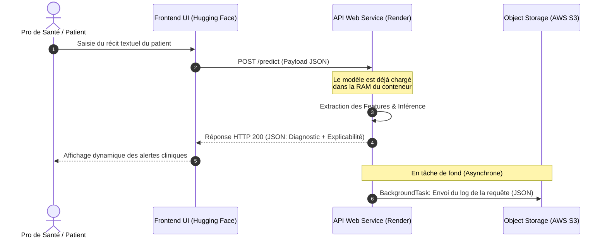
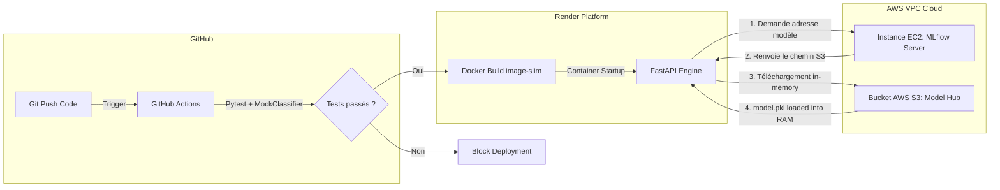
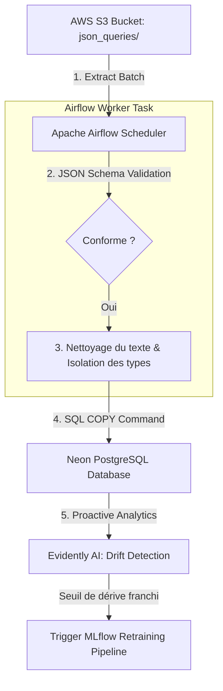

```mermaid

sequenceDiagram
    autonumber
    actor User as Pro de Santé / Patient
    participant HF as Frontend UI (Hugging Face)
    participant Render as API Web Service (Render)
    participant S3 as Object Storage (AWS S3)

    User->>HF: Saisie du récit textuel du patient
    HF->>Render: POST /predict (Payload JSON)
    Note over Render: Le modèle est déjà chargé<br/>dans la RAM du conteneur
    Render->>Render: Extraction des Features & Inférence
    Render-->>HF: Réponse HTTP 200 (JSON: Diagnostic + Explicabilité)
    HF-->>User: Affichage dynamique des alertes cliniques

    Note over Render, S3: En tâche de fond (Asynchrone)
    Render->>S3: BackgroundTask: Envoi du log de la requête (JSON)

```

```mermaid

graph LR
    subgraph GitHub_Platform [GitHub]
        A[Git Push Code] -->|Trigger| B[GitHub Actions]
        B -->|Pytest + MockClassifier| C{Tests passés ?}
    end

    subgraph Compute_Layer [Render Platform]
        D[Docker Build image-slim] -->|Container Startup| E[FastAPI Engine]
    end

    subgraph AWS_Infrastructure [AWS VPC Cloud]
        F[Instance EC2: MLflow Server]
        G[Bucket AWS S3: Model Hub]
    end

    C -->|Oui| D
    C -->|Non| H[Block Deployment]

    E -->|1. Demande adresse modèle| F
    F -->|2. Renvoie le chemin S3| E
    E -->|3. Téléchargement in-memory| G
    G -->|4. model.pkl loaded into RAM| E

```

```mermaid

graph TD
    S3_Raw[AWS S3 Bucket: json_queries/] -->|1. Extract Batch| Airflow[Apache Airflow Scheduler]

    subgraph Processing_Worker [Airflow Worker Task]
        Airflow -->|2. JSON Schema Validation| Validate{Conforme ?}
        Validate -->|Oui| Transform[3. Nettoyage du texte & Isolation des types]
    end

    Transform -->|4. SQL COPY Command| Neon[Neon PostgreSQL Database]
    Neon -->|5. Proactive Analytics| Evidently[Evidently AI: Drift Detection]
    Evidently -->|Seuil de dérive franchi| Retrain[Trigger MLflow Retraining Pipeline]

```
